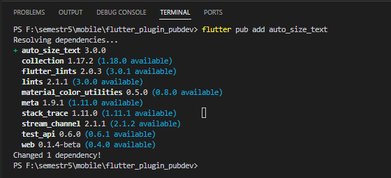
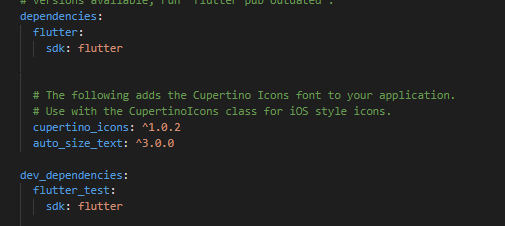
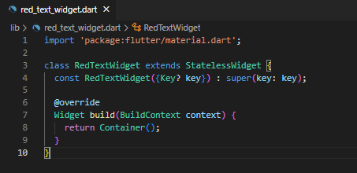
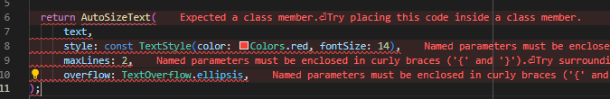
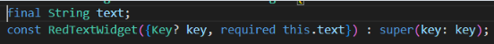
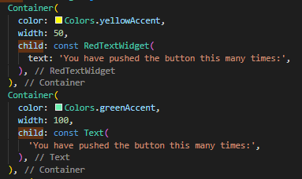
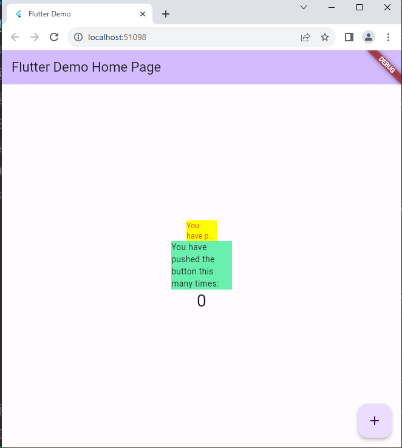

# Nama : Muhammad Bagas Ramadhan
# Kelas : TI - 3G
# Nim : 2141720120
# Praktikum Menerapkan Plugin di Project Flutter

## Langkah 1: Buat Project Baru
Buatlah sebuah project flutter baru dengan nama flutter_plugin_pubdev. Lalu jadikan repository di GitHub Anda dengan nama flutter_plugin_pubdev.

## Langkah 2: Menambahkan Plugin
Tambahkan plugin auto_size_text menggunakan perintah berikut di terminal

Jika berhasil, maka akan tampil nama plugin beserta versinya di file pubspec.yaml pada bagian dependencies.

## Langkah 3: Buat file red_text_widget.dart
Buat file baru bernama red_text_widget.dart di dalam folder lib lalu isi kode seperti berikut.

## Langkah 4: Tambah Widget AutoSizeText
Masih di file red_text_widget.dart, untuk menggunakan plugin auto_size_text, ubahlah kode return Container() menjadi seperti berikut.

Setelah Anda menambahkan kode di atas, Anda akan mendapatkan info error. Mengapa demikian? 

Jawab : Karena variabel text tidak dideklarasikan dan perlu menyertakan teks yang akan ditampilkan sebagai argumen dalam konstruktor RedTextWidget.

## Langkah 5: Buat Variabel text dan parameter di constructor
Tambahkan variabel text dan parameter di constructor seperti berikut.

## Langkah 6: Tambahkan widget di main.dart
Buka file main.dart lalu tambahkan di dalam children: pada class _MyHomePageState

## Run aplikasi tersebut dengan tekan F5, maka hasilnya akan seperti berikut.

# Tugas Praktikum

1. Selesaikan Praktikum tersebut, lalu dokumentasikan dan push ke repository Anda berupa screenshot hasil pekerjaan beserta penjelasannya di file README.md!

2. Jelaskan maksud dari langkah 2 pada praktikum tersebut!
JAWAB : flutter pub add auto_size_text merupakan perintah yang dipakai di Flutter untuk menambahkan sebuah paket atau perpustakaan ke dalam proyek. Dalam konteks ini, perintah tersebut dimaksudkan untuk menambahkan paket yang disebut "auto_size_text" ke dalam proyek Flutter. Dengan langkah ini, kita akan dapat memanfaatkan semua fitur yang disediakan oleh paket "auto_size_text" dalam proyek, termasuk kemampuan untuk menyesuaikan ukuran teks secara otomatis.

3. Jelaskan maksud dari langkah 5 pada praktikum tersebut!
JAWAB: Kode ini mengintegrasikan variabel "text" ke dalam kelas RedTextWidget. Variabel ini akan berperan dalam menentukan teks yang ditampilkan oleh widget ini. Selanjutnya, dengan menambahkan parameter "required this.text" ke dalam konstruktor RedTextWidget, langkah tersebut memastikan bahwa saat menciptakan instansi dari RedTextWidget, nilai teks yang diperlukan harus disediakan melalui parameter ini.

4. Pada langkah 6 terdapat dua widget yang ditambahkan, jelaskan fungsi dan perbedaannya!
Jelaskan maksud dari tiap parameter yang ada di dalam plugin auto_size_text berdasarkan tautan pada dokumentasi ini !
JAWAB :
- Kotak kuning (Container) dengan teks yang disesuaikan di dalamnya (Menggunakan widget RedTextWidget).

- Kotak hijau (Container) dengan teks biasa di dalamnya (menggunakan widget Text) tanpa ada penyesuaian khusus.

Jadi, yang membedakan adalah tampilan dan gaya teks yang digunakan. Kotak pertama memakai widget buatan sendiri buat menampilkan teks dengan gaya spesifik, sedangkan kotak kedua hanya menggunakan teks biasa tanpa ada gaya tambahan.

5. Jelaskan maksud dari tiap parameter yang ada di dalam plugin auto_size_text berdasarkan tautan pada dokumentasi ini !
JAWAB: Parameter-parameter digunakan untuk mengkonfigurasikan dan menyesuaikan cara kerja widget tersebut. Dapat berisi parameter untuk mengatur teks yang muncul, gaya teks, batasan jumlah baris, overflow, dan lain sebagainya.
